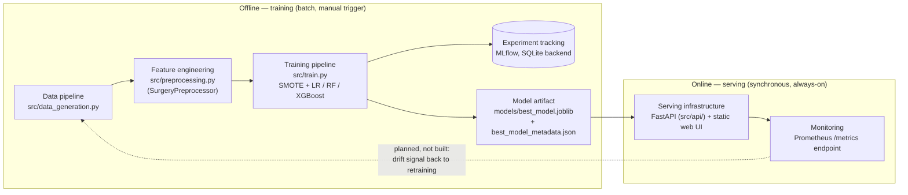
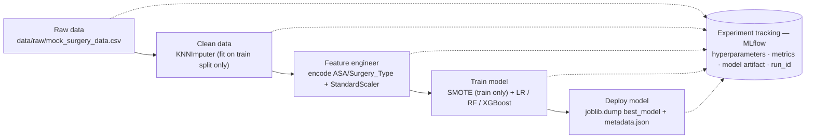
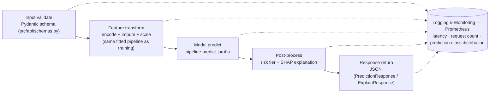

# System Architecture — CDC/CCI Surgical Risk Prediction

This document maps the system to the standard production-ML-system components
and pipeline patterns covered in DDM501, states which parts were built as
designed, which were deliberately simplified for this project's scale, and
why three patterns discussed in class (Lambda/Kappa streaming, ML
microservices decomposition, and multi-model serving) were each considered
and rejected in favor of a monolithic design.

## 1. System components

| Component (standard ML system) | This project | Status |
|---|---|---|
| Data pipeline | `src/data_generation.py` → `data/raw/` | Done — synthetic generator; a real deployment swaps this for an EMR/HIS extract |
| Feature store | Not a separate service — feature encode/impute/scale lives inside `SurgeryPreprocessor`, as one step of the training/serving pipeline | Deliberately out of scope (see §6) |
| Training pipeline | `src/train.py` | Done |
| Model registry | MLflow logs every run (params/metrics/model); "promotion" to serving is a convention — the highest-ROC-AUC run's pipeline is saved as `models/best_model.joblib` and reloaded by the API | Partial — no MLflow Model Registry stage transitions (Staging/Production aliases) |
| Serving infrastructure | `src/api/` (FastAPI) + `web/` (static UI) | Done |
| Monitoring system | `/metrics` (Prometheus client) exposes request latency, request count, prediction-class distribution | Instrumentation done; Prometheus server + Grafana dashboards are the next build step (Docker Compose) |
| Monitoring → data pipeline feedback (drift-triggered retraining) | Not built | Future work |

## 2. Why so much of this isn't "the model"

Per Sculley et al., *Hidden Technical Debt in Machine Learning Systems*
(NeurIPS 2015): the actual model-fitting code is a small box inside a much
larger system. In this repo, `model.fit()` is one line inside
`src/train.py`; the surrounding configuration, data validation, a
train/test-safe preprocessing pipeline, API schemas, serving code, and
metrics instrumentation are the rest of the diagram above — and were the
majority of the implementation effort, which matches what the course
material predicts.

## 3. Training pipeline

**Trigger:** manual only (`python -m src.train`). Scheduled (daily/weekly)
or data-change-triggered retraining, as shown on the course slide, is not
implemented — noted as future work in §6.

**One correctness fix versus the original class notebooks:** `KNNImputer`
and `StandardScaler` are fit on the train split only (`SurgeryPreprocessor`
in `src/preprocessing.py`) and only ever `.transform()` the test split. The
original notebooks fit them on the full dataset before splitting, which
leaks test-set statistics into training.

## 4. Inference pipeline

There is no separate "feature lookup" service: for this use case the
features *are* what the clinician enters at the point of care (pre-op
labs, ASA score, comorbidities), so there is nothing to pre-compute or
look up from an online store — the raw request body is the feature vector
before pipeline transformation.

**Latency** (measured locally, 10 sequential requests each, no load —
indicative, not a load-test result):

| Endpoint | p50 | Course target | Result |
|---|---|---|---|
| `POST /api/v1/predict` | ~12 ms | < 100 ms (real-time) | within target |
| `POST /api/v1/predict/explain` (SHAP) | ~18 ms (max observed 40 ms) | < 1 s (near real-time) | within target |

## 5. Patterns considered and rejected

### 5.1 Streaming: Lambda / Kappa architecture

Lambda and Kappa architectures (batch + speed layer, or unified stream
processing via a replayable log) solve a problem this project doesn't
have: continuously arriving event data that must be queryable both with
high accuracy (batch) and low latency (stream). Our input is a single
EMR/HIS batch export (5,000 synthetic records) and inference is a
synchronous request/response per patient at the point of care — not a
stream. Adopting either pattern would add Kafka/stream-processing
infrastructure whose documented costs (per the course slide) are exactly
what this project doesn't want to pay for no corresponding benefit:

- code duplication (two processing paths)
- materially higher operational complexity
- higher infrastructure cost

This is a deliberate scope decision, not an oversight.

### 5.2 Microservice ML architecture — not adopted (yet)

The course's Microservice ML architecture splits Data / Feature / Training
/ Serving into independent services around a Kafka message bus, each with
its own DB, observed via Prometheus + Grafana + ELK. The course's own
**Decision Framework (Monolithic vs Microservices)** gives explicit
criteria for when to use which — every "start with monolithic" criterion
applies to this project, and none of the "move to microservices" triggers
are present:

| Decision Framework criterion | This project | Applies? |
|---|---|---|
| Team < 5 engineers | Course team | Monolithic |
| Single use case / model | One target: `High_Risk_Flag` | Monolithic |
| Need fast iteration | Course deadline | Monolithic |
| Low traffic volume | Demo/course scale | Monolithic |
| Unclear requirements | Requirements still being refined | Monolithic |
| Multiple teams on different models | No — one team, one model | — |
| Different scaling needs per component | No — uniform, low load | — |
| Need independent deployment cycles | No | — |
| High availability requirements | No — course demo, not a live clinical system | — |
| Clear service boundaries | Not yet established | — |

Every signal points to monolithic. What's implemented is actually the
course's own **"Hybrid approach (most common)"** row, half-adopted: a
monolithic training pipeline (`src/train.py`, one script) — but *also* a
monolithic serving process (single FastAPI app for both API and web UI),
not "microservices for serving." A shared feature store was rejected for
the same reason as above (§6) — one model, nothing to share.

**If this grows** (more models, multiple teams, independent scaling of
training vs. serving), the documented next step is exactly the course
diagram: split into Data/Feature/Training/Serving services on a Kafka bus,
trading the pros (independent scaling, technology flexibility, fault
isolation, faster deployments) for the cons (network latency, complex
debugging, data-consistency challenges, operational overhead) — a trade
not worth making yet.

### 5.3 Multi-model serving pattern — single champion, not ensemble

`src/train.py` trains three candidate models (Logistic Regression, Random
Forest, XGBoost) and logs each as its own MLflow run — which briefly
resembles **Pattern 1 (Model-as-a-service)** during offline comparison.
At serving time, though, only one pattern from the course slide was
actually considered relevant, and it was rejected in favor of something
simpler still:

| Pattern | Would mean | Rejected because |
|---|---|---|
| Pattern 1 — Model-as-a-service (one service per model) | 3 separate deployed services | One business decision per patient; 3x serving infra for no product benefit |
| Pattern 2 — Gateway + model pool | A router choosing which model answers | Nothing to route on — there's no per-request criterion for picking LR vs RF vs XGBoost |
| Pattern 3 — Ensemble service | Combine all 3 outputs into one prediction | ROC-AUC spread across the 3 is small (0.924–0.937); ensembling adds latency/complexity for a gain unlikely to be clinically meaningful, and it muddies SHAP explainability (whose explanation would `/predict/explain` return?) |

Instead, `run_training()` picks the single highest-ROC-AUC model as
"champion" and only that pipeline is saved and served
(`models/best_model.joblib`) — the simplest of the four patterns on the
slide, chosen because nothing in this project's requirements justifies
the other three.

## 6. Trade-offs summary

| Decision | Choice made | Why | Cost of the choice |
|---|---|---|---|
| Feature store | None — feature logic lives in the pipeline | 8 tabular features, single model, no sharing across multiple models/teams that would justify one | Would need to be introduced if the org grows to multiple models sharing features |
| Model registry | MLflow tracking only, manual "promote by best ROC-AUC" convention | Fast to implement, transparent, sufficient for a single deployed model | No audit trail of *why* a model was promoted, no staged rollout (canary/shadow) |
| Retraining trigger | Manual CLI only | Matches course scope; no live data source to react to yet | No automatic response to data drift or new data |
| Serving | Single FastAPI process serving both API and static web UI | Simplicity — one container, one deploy unit, no CORS to manage | Web UI and API can't be scaled or versioned independently |
| MLflow backend | SQLite (`mlflow.db`) | Zero external dependency, fine for a single contributor / course project | Single-writer bottleneck; would need Postgres for concurrent multi-user training |
| Orchestration | Docker Compose (next step), not Kubernetes | Right-sized for a single-node course deployment | Doesn't horizontally autoscale; acceptable at this traffic scale |
| Streaming (Lambda/Kappa) | Rejected | No streaming data source exists | N/A |
| Service decomposition | Monolithic (one API process, one training script) | Every Decision Framework "start monolithic" criterion applies (§5.2); none of the microservices triggers do | Revisit if team/model count/traffic grows |
| Multi-model serving | Single champion model, not ensemble/gateway/model-as-a-service | ROC-AUC spread across candidates too small to justify the added latency, ops cost, and explainability ambiguity (§5.3) | Foregoes the small possible accuracy gain from ensembling |

## 7. Technology stack justification

| Choice | Alternative considered | Why this one |
|---|---|---|
| FastAPI | Flask | Async, Pydantic request validation for free, auto-generated OpenAPI/Swagger docs (satisfies the Documentation rubric item directly) |
| MLflow (SQLite backend) | Weights & Biases | Open-source, self-hosted, no external account/cost; course-recommended |
| scikit-learn/imblearn `Pipeline` as the single saved artifact | Separate preprocessing microservice | Guarantees train/serve parity — the exact object fit in `src/train.py` is the exact object that answers `/predict`, so there is no second implementation of preprocessing to drift out of sync |
| Docker Compose | Kubernetes | Course-scoped, single-node deployment; k8s complexity isn't justified at this traffic/team size |
| Prometheus client (raw) | `prometheus-fastapi-instrumentator` | One fewer dependency; metrics definitions stay explicit and visible in `src/api/main.py` |

## 8. Known limitations / future work

- No feature store, no online drift monitoring loop, no automated retraining trigger
- Model "registry" is a naming convention, not MLflow's staged registry
- No authentication on the API (acceptable for a course demo; not for real PHI)
- Trained and validated on synthetic data only — not clinically validated
- MLflow SQLite backend does not support concurrent multi-writer training
